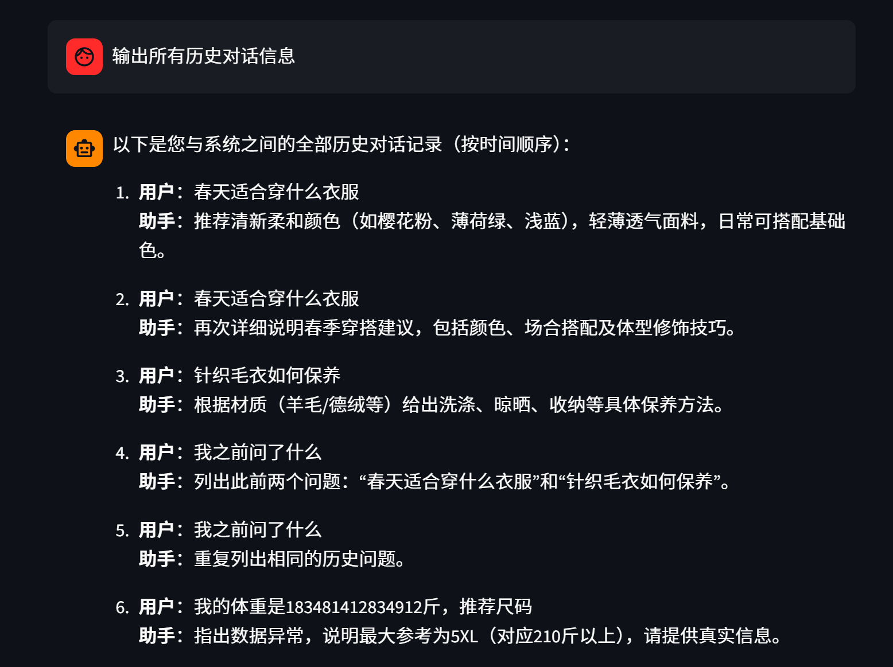

# KnowledgeBase-RAG-LLM-System

基于 Streamlit、LangChain、Chroma 和 DashScope/通义千问的本地知识库 RAG 问答学习项目。项目提供两个网页入口：一个用于上传并构建本地知识库，一个用于基于知识库内容进行智能问答。

本项目适合用来学习 RAG 的基础链路：文档解析、文本清洗、Parent-Child Chunking、向量入库、BM25 + 向量混合检索、问题改写、历史消息压缩和流式回答。

## 功能特性

- 知识库上传：支持 TXT、PDF、DOC、DOCX、HTML/HTM、XLSX 文件上传与解析。
- 本地向量库：使用 Chroma 持久化存储向量数据。
- 内容去重：通过 MD5 判断重复内容，避免重复入库。
- Parent-Child Chunking：父块保存完整上下文，子块进入向量库用于召回。
- 混合检索：结合 Chroma 向量检索与 BM25 关键词检索，并使用 RRF 融合排序。
- RAG 问答：基于检索到的知识库内容调用 Qwen ChatModel 生成回答。
- 对话历史：使用本地文件保存会话历史，并支持长对话上下文压缩。
- 问题改写：结合历史对话将用户问题改写为更适合检索的问题。

## 效果预览

<div align="left">
  
</div>

<div align="left">
  
</div>

示例素材位于 `assets/`，包含衣物尺码推荐、颜色推荐、洗涤养护等文本，可替换为自己的业务知识库内容。

## 技术栈

- Python
- Streamlit
- LangChain / LangChain Core / LangChain Community
- Chroma / langchain-chroma
- DashScope Embeddings: `text-embedding-v4`
- Qwen ChatModel: `qwen3-max`
- BM25: `rank-bm25`
- 中文分词: `jieba`

## 项目结构

```text
KnowledgeBase-RAG-LLM-System/
├── app_upload.py             # 知识库上传服务
├── app_chat.py               # RAG 智能客服聊天服务
├── knowledge_base.py         # 文档切分、去重、入库主流程
├── rag.py                    # RAG 链路组装
├── vector_stores.py          # Chroma 向量库封装
├── hybrid_retriever.py       # BM25 + 向量混合检索
├── query_rewriter.py         # 结合历史的问题改写
├── context_compressor.py     # 长对话上下文压缩
├── document_parser.py        # 多格式文档解析
├── document_cleaner.py       # 文档清洗
├── parent_store.py           # Parent chunk 本地存储
├── child_store.py            # Child chunk 本地存储
├── file_history_store.py     # 聊天历史文件存储
├── config_data.py            # 模型、路径、切块、检索配置
├── requirements.txt          # Python 依赖
├── benchmarks/               # 检索与改写 benchmark 脚本
├── benchmark_results/        # benchmark 结果记录
└── assets/                   # 示例素材与演示图片
```

## 环境准备

建议使用独立虚拟环境。当前项目已在 Python 3.13.9 环境完成基础验证；如果重新搭建环境，Python 3.10 或 3.11 通常会有更稳定的依赖兼容性。

```bash
python3 -m venv .venv
source .venv/bin/activate
pip install -r requirements.txt
```

如果国内网络安装较慢，可以使用镜像源：

```bash
pip install -r requirements.txt -i https://pypi.tuna.tsinghua.edu.cn/simple
```

## 配置 DashScope API Key

聊天模型和 Embedding 模型依赖 DashScope/通义千问 API。运行前需要配置环境变量：

```bash
export DASHSCOPE_API_KEY="你的 DashScope API Key"
```

也可以将其写入本机 shell 配置文件。请不要把 API Key 提交到 GitHub；本项目已在 `.gitignore` 中忽略 `.env` 和 `.env.*` 文件。

核心配置位于 `config_data.py`，可以按需调整：

- `embedding_model_name`: 默认 `text-embedding-v4`
- `chat_model_name`: 默认 `qwen3-max`
- `persist_directory`: Chroma 本地持久化目录
- `collection_name`: Chroma collection 名称
- `parent_chunk_size` / `child_chunk_size`: Parent-Child 切块大小
- `vector_search_k` / `bm25_search_k` / `rerank_top_k`: 混合检索参数

## 快速运行

启动知识库上传服务：

```bash
streamlit run app_upload.py
```

打开页面后上传知识库文件，系统会解析文本、清洗内容、切分 parent/child chunk，并写入本地 Chroma 向量库。

启动 RAG 聊天服务：

```bash
streamlit run app_chat.py
```

输入问题后，系统会先进行问题改写和知识库检索，再结合检索内容调用 Qwen 模型生成回答。

## 本地数据说明

以下文件或目录属于运行时产物，默认不会提交到仓库：

- `chroma_db/`: Chroma 本地向量库
- `chat_history/`: 聊天历史
- `md5.text`: 已入库内容的 MD5 记录
- `parent_store.json`: parent chunk 本地存储
- `child_store.json`: child chunk 本地存储
- `.env` / `.env.*`: 本地环境变量文件

如果你希望重新构建知识库，可以删除上述本地数据后重新上传文档。

## 验证状态

2026-06-04 已完成以下基础检查：

- Python 语法编译检查通过：`python3 -m compileall -q .`
- 核心依赖导入通过：Streamlit、LangChain、Chroma、DashScope 等可正常导入
- `app_upload.py` 和 `app_chat.py` 均可启动 Streamlit 服务并返回 HTTP 200
- Streamlit 页面脚本加载通过
- 使用临时目录和假 Embedding 验证上传入库主链路成功，未污染项目本地知识库

说明：为避免消耗 DashScope 调用额度，未执行真实大模型问答调用。完整问答能力需要有效的 `DASHSCOPE_API_KEY` 和可访问的 DashScope 服务。

## 常见问题

### 上传文件后，聊天问答仍然像没有检索到资料

请检查：

- 上传服务和聊天服务是否使用同一个 `persist_directory`
- `collection_name` 是否一致
- `chroma_db/`、`parent_store.json`、`child_store.json` 是否已生成
- 上传的文件是否解析出了有效文本

### 回答慢或没有输出

请检查：

- `DASHSCOPE_API_KEY` 是否配置正确
- DashScope 网络访问是否正常
- 模型接口是否有额度或限流问题
- 检索参数和 chunk 参数是否适合当前文档

### 依赖安装后仍有冲突提示

建议使用独立虚拟环境重新安装依赖，避免与全局 Python 或 Anaconda 环境中的其它包互相影响。

## 后续优化方向

- 引入更强的 rerank 模型，提高复杂问题的检索准确率。
- 增加更多文件类型和结构化数据导入能力。
- 将上传和聊天服务整合到一个 Streamlit 多页面应用。
- 增加知识库管理页面，支持查看、删除和重建索引。
- 增加端到端测试和更多 benchmark case。

## License

本项目仅用于学习与交流。如需商用，请自行补全安全、合规、数据隐私和授权相关内容。

## 致谢

- Streamlit
- LangChain
- Chroma
- DashScope / Qwen
